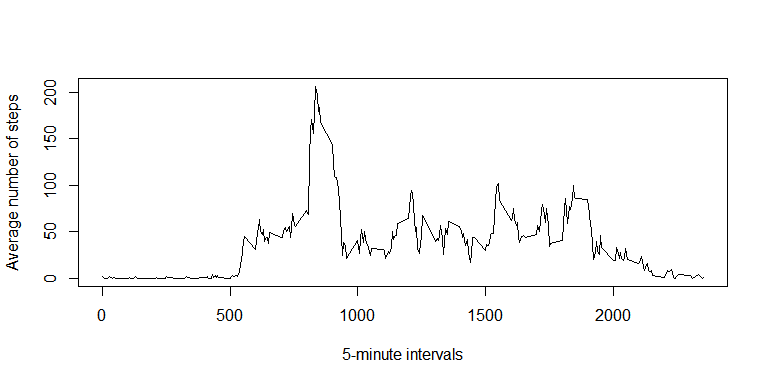
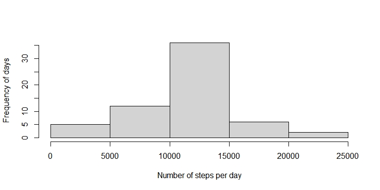
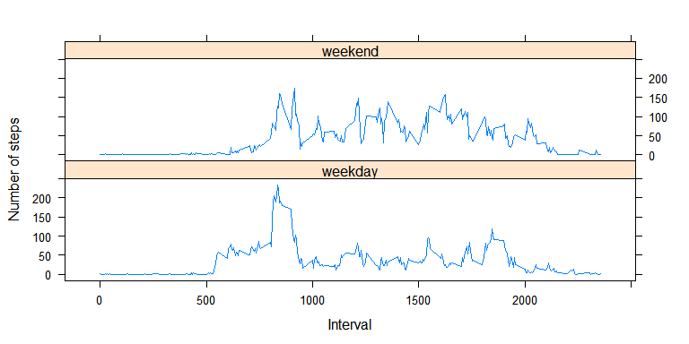

## Loading and preprocessing the data

#### 1. Loading packages and data.


```r
library(dplyr)
library(lubridate)
library(lattice)
unzip("activity.zip")
data <- read.csv(file = "activity.csv")
```

#### 2. Transforming dates from char to date.


```r
data$date <- as.Date(data$date)
```
----

## What is mean total number of steps taken per day?

#### 1. Histogram of the total number of steps taken each day.

* #### Group data by date and summarize sum of steps for each date.


```r
aux <- data %>% group_by(date) %>% summarize(tsteps = sum(steps, na.rm = FALSE))
```

* #### Histogram of the total number of steps taken each day.


```r
hist(aux$tsteps, xlab = "Number of steps per day", ylab = "Frequency of days", main = "")
```


#### 2. The mean and median number of steps taken by date.


```r
data %>% group_by(date) %>% summarize(means = mean(steps, na.rm = FALSE),medians = median(steps,  na.rm = FALSE))
```

```
## # A tibble: 61 x 3
##    date        means medians
##    <date>      <dbl>   <dbl>
##  1 2012-10-01 NA          NA
##  2 2012-10-02  0.438       0
##  3 2012-10-03 39.4         0
##  4 2012-10-04 42.1         0
##  5 2012-10-05 46.2         0
##  6 2012-10-06 53.5         0
##  7 2012-10-07 38.2         0
##  8 2012-10-08 NA          NA
##  9 2012-10-09 44.5         0
## 10 2012-10-10 34.4         0
## # ... with 51 more rows
```

#### 3. Mean and median of total number of steps taken per day.


```r
aux %>% summarise(total_mean = mean(tsteps, na.rm = TRUE), total_median = median(tsteps,na.rm = TRUE))
```

```
## # A tibble: 1 x 2
##   total_mean total_median
##        <dbl>        <int>
## 1     10766.        10765
```
----

## What is the average daily activity pattern?

#### 1. Time series plot of the 5-minute interval (x-axis) and the average number of steps taken (y-axis), averaged across all days.

* #### Calculating mean number of steps taken for each time interval.


```r
aux <- data %>% group_by(interval) %>% summarize(msteps = mean(steps, na.rm = TRUE))
```

* #### Plotting time series graph.


```r
plot(aux$interval,aux$msteps,type = "l",ylab = "Average number of steps", xlab = "5-minute intervals")
```



#### 2. Which 5-minute interval, on average across all the days in the dataset, contains the maximum number of steps?

* #### Subsetting row that corresponds to maximum average number of steps (interval 835).


```r
aux[aux$msteps == max(aux$msteps),]
```

```
## # A tibble: 1 x 2
##   interval msteps
##      <int>  <dbl>
## 1      835   206.
```
----

## Imputing missing values

#### 1. Total number of missing values in the dataset (i.e. the total number of rows with NAs).


```r
sum(!complete.cases(data))
```

```
## [1] 2304
```

#### 2. Strategy for filling in all of the missing values in the dataset: Using the mean for the 5-minute interval as integer.


```r
dataclean <- data
for(i in 1:nrow(dataclean)){
    if(is.na(dataclean$steps[i])){
        fill<- as.integer(aux[aux$interval==dataclean$interval[i],]$msteps)
        dataclean$steps[i] <- fill
    }
}
```

#### 3. New dataset with the missing data filled in.


```r
head(dataclean,10)
```

```
##    steps       date interval
## 1      1 2012-10-01        0
## 2      0 2012-10-01        5
## 3      0 2012-10-01       10
## 4      0 2012-10-01       15
## 5      0 2012-10-01       20
## 6      2 2012-10-01       25
## 7      0 2012-10-01       30
## 8      0 2012-10-01       35
## 9      0 2012-10-01       40
## 10     1 2012-10-01       45
```

#### 4. Histogram of the total number of steps taken each day and the **mean** and **median** total number of steps taken per day. Do these values differ from the estimates from the first part of the assignment? What is the impact of imputing missing data on the estimates of the total daily number of steps?

* #### Histogram of the total number of steps taken each day.


```r
aux <- dataclean %>% group_by(date) %>% summarize(tsteps = sum(steps))
```


```r
hist(aux$tsteps, xlab = "Number of steps per day", ylab = "Frequency of days", main = "")
```



* #### The mean and median number of steps taken by date.


```r
dataclean %>% group_by(date) %>% summarize(means = mean(steps),medians = median(steps))
```

```
## # A tibble: 61 x 3
##    date        means medians
##    <date>      <dbl>   <dbl>
##  1 2012-10-01 36.9      33.5
##  2 2012-10-02  0.438     0  
##  3 2012-10-03 39.4       0  
##  4 2012-10-04 42.1       0  
##  5 2012-10-05 46.2       0  
##  6 2012-10-06 53.5       0  
##  7 2012-10-07 38.2       0  
##  8 2012-10-08 36.9      33.5
##  9 2012-10-09 44.5       0  
## 10 2012-10-10 34.4       0  
## # ... with 51 more rows
```

* #### Mean and median of total number of steps taken per day.


```r
aux %>% summarise(total_mean = mean(tsteps), total_median = median(tsteps))
```

```
## # A tibble: 1 x 2
##   total_mean total_median
##        <dbl>        <int>
## 1     10750.        10641
```

> Overall shape of histogram did not change. Peak of the graph increased, from a frequency of just over 25 days in the first graph, to about 35 in the graph with the NAs filled in. Mean total number of steps decreased by 16 steps while median total decreased by 124 steps in the imputed data.   

----

## Are there differences in activity patterns between weekdays and weekends?

#### 1. Create a new factor variable in the dataset with two levels indicating whether a given date is a weekday or weekend day.

* #### Mapping weekends (TRUE) and weekdays (FALSE) to logical vector.


```r
vet <- sapply(data$date,function(e){
        wd <- wday(e)
        if(wd == 1  || wd == 7) TRUE
        else FALSE })
```

* #### Adding new variable named wkend containing logical vector as factor. 


```r
data$wkend <- factor(vet)
```

* #### Splitting data according to wkend.


```r
dlist <- split(data, data$wkend)
```

* #### Calculating mean number of steps per time interval for each dataframe in the list and merging the two.


```r
dlist$'FALSE' <- dlist$'FALSE' %>% group_by(interval) %>% summarize(msteps = mean(steps, na.rm = TRUE))
dlist$'FALSE' <- cbind.data.frame(dlist$'FALSE',wkend = "weekday")
dlist$'TRUE' <- dlist$'TRUE' %>% group_by(interval) %>% summarize(msteps = mean(steps, na.rm = TRUE))
dlist$'TRUE' <- cbind.data.frame(dlist$'TRUE', wkend = "weekend")
final <- rbind.data.frame(dlist$'FALSE',dlist$'TRUE')
```

#### 2. Panel plot containing a time series plot of the 5-minute interval (x-axis) and the average number of steps taken (y-axis), averaged across all weekday days or weekend days.


```r
xyplot(msteps ~ interval | wkend ,data = final, type = "l", layout = c(1,2), ylab = "Number of steps", xlab = "Interval")
```



----

